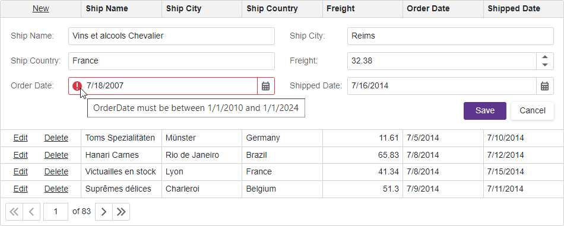

<!-- default badges list -->

[](https://supportcenter.devexpress.com/ticket/details/T1155154)
[](https://docs.devexpress.com/GeneralInformation/403183)
<!-- default badges end -->
# Grid for Blazor - How to bind the component to an Instant Feedback data source and enable edit operations

This example demonstrates how to use the [Entity Framework Core](https://learn.microsoft.com/en-us/ef/core/) data access technology to bind the [DevExpress Blazor Grid](https://docs.devexpress.com/Blazor/403143/grid) component to an [Instant Feedback data source](https://docs.devexpress.com/Blazor/403737/grid/bind-to-data#large-data-server-mode-sources). In the example, you can add, edit, and delete data rows in the Grid component. The Grid validates input data and displays error messages.



## Overview

Instant Feedback data sources are designed to work with large data collections. They load data in small portions on demand in background threads and do not freeze the Grid UI. Instant Feedback data sources help you to reduce memory consumption but impose multiple limitations. Refer to the following topic for more information: [Server Mode Sources - Common Specifics and Limitations](https://docs.devexpress.com/Blazor/403737/grid/bind-to-data#common-specifics-and-limitations).

### Bind the Grid to an Instant Feedback Data Source

Follow the steps below to use the Entity Framework Core technology to bind the Grid component to an Instant Feedback data source:

1. Add the following NuGet packages to your project:

    * [EntityFrameworkCore](https://www.nuget.org/packages/Microsoft.EntityFrameworkCore)
    * [EntityFrameworkCore.Tools](https://www.nuget.org/packages/Microsoft.EntityFrameworkCore.Tools/)
    * [EntityFrameworkCore.SqlServer](https://www.nuget.org/packages/Microsoft.EntityFrameworkCore.SqlServer/)

2. Create a model for your database and register the database context.
3. Register a [DbContext factory](https://learn.microsoft.com/en-us/ef/core/dbcontext-configuration/#using-a-dbcontext-factory-eg-for-blazor) in the `Program.cs` file.
4. Add references to the model, data source, and data access technology namespaces to the page that displays the Grid component. Use the `@inject` Razor directive to inject the DbContext factory service into the component: 

    ```razor
    @using InstantFeedback.Models;
    @using Microsoft.EntityFrameworkCore
    @using DevExpress.Data.Linq
    @inject IDbContextFactory<NorthwindContext> NorthwindContextFactory
    ```
5. Create an instance of the [EntityInstantFeedbackSource](https://docs.devexpress.com/CoreLibraries/DevExpress.Data.Linq.EntityInstantFeedbackSource) class, specify its parameters, and bind it to the Grid's [Data](https://docs.devexpress.com/Blazor/DevExpress.Blazor.DxGrid.Data) property:

    ```razor
    <DxGrid Data="InstantFeedbackSource">
        <!-- ... -->
    </DxGrid>

    @code {
        EntityInstantFeedbackSource InstantFeedbackSource { get; set; }
        NorthwindContext Northwind { get; set; }

        protected override void OnInitialized() {
            Northwind = NorthwindContextFactory.CreateDbContext();
            InstantFeedbackSource = new EntityInstantFeedbackSource(e => {
                e.KeyExpression = "OrderId";
                e.QueryableSource = Northwind.Orders;
            });
        }
    }
    ```
6. Implement the [IDisposable](https://learn.microsoft.com/en-us/dotnet/api/system.idisposable?view=net-7.0) interface and dispose of the data source instance and context in the page's [Dispose](https://learn.microsoft.com/en-us/dotnet/api/system.idisposable.dispose?view=net-7.0) method:

    ```razor
    @implements IDisposable
    // ...
    @code {
        //...
        public void Dispose() {
            InstantFeedbackSource?.Dispose();
            Northwind?.Dispose();
        }
    }
    ```

### Enable Edit Operations

The Grid component supports multiple [edit modes](https://docs.devexpress.com/Blazor/403454/grid/edit-data-and-validate-input#edit-modes). Follow the steps below to allow users to edit grid data in edit form mode:

1. Declare a [DxGridCommandColumn](https://docs.devexpress.com/Blazor/DevExpress.Blazor.DxGridCommandColumn) object in the Grid's [Columns](https://docs.devexpress.com/Blazor/DevExpress.Blazor.DxGrid.Columns) template. This column displays the predefined **New**, **Edit**, and **Delete** command buttons.

2. Use the [EditFormTemplate](https://docs.devexpress.com/Blazor/DevExpress.Blazor.DxGrid.EditFormTemplate) property to define edit form content. Add the [ValidationSummary](https://learn.microsoft.com/en-us/dotnet/api/microsoft.aspnetcore.components.forms.validationsummary?view=aspnetcore-7.0) component to the edit form to validate user input based on [data annotation attributes](https://learn.microsoft.com/en-us/aspnet/core/mvc/models/validation?view=aspnetcore-7.0) defined in the model.

3. The [EditModelSaving](https://docs.devexpress.com/Blazor/DevExpress.Blazor.DxGrid.EditModelSaving) event occurs after a user submits the edit form and validation is passed. Use the [EditModel](https://docs.devexpress.com/Blazor/DevExpress.Blazor.GridEditModelSavingEventArgs.EditModel) event argument to access the edit model that stores all changes. Copy the values of all edit model fields that can be changed to the corresponding fields of the [DataItem](https://docs.devexpress.com/Blazor/DevExpress.Blazor.GridEditModelSavingEventArgs.DataItem) event argument, then save changes to the bound data source. To assign all edit model field values to the data item fields simultaneously, you can call the [AutoMapper](https://github.com/AutoMapper/AutoMapper) library's `Map` method.

4. The [DataItemDeleting](https://docs.devexpress.com/Blazor/DevExpress.Blazor.DxGrid.DataItemDeleting) event occurs once a user confirms the delete operation in the delete confirmation dialog. In the event handler, check user input and access permissions and post changes to the data source.

5. If your data object has a primary key, assign it to the [KeyFieldName](https://docs.devexpress.com/Blazor/DevExpress.Blazor.DxGrid.KeyFieldName) or [KeyFieldNames](https://docs.devexpress.com/Blazor/DevExpress.Blazor.DxGrid.KeyFieldNames) property. If you do not specify these properties, the Grid uses standard [.NET value equality comparison](https://learn.microsoft.com/en-us/dotnet/csharp/programming-guide/statements-expressions-operators/equality-comparisons) to identify data items.

Refer to the following topic for more information on how to enable edit operations and validate user input in the Grid control: [Edit Data and Validate Input](https://docs.devexpress.com/Blazor/403454/grid/edit-data-and-validate-input).

## Files to Review

- [Index.razor](./CS/Pages/Index.razor)
- [Program.cs](./CS/Program.cs)
- [Invoice.cs](./CS/Models/Invoice.cs)
- [NorthwindContext.cs](./CS/Models/NorthwindContext.cs)

## Documentation

- [Bind to Data](https://docs.devexpress.com/Blazor/403737/grid/bind-to-data)
- [Bind Components to Data with Entity Framework Core](https://docs.devexpress.com/Blazor/403167/common-concepts/bind-data-grid-to-data-from-entity-framework-core)
- [Edit Data and Validate Input](https://docs.devexpress.com/Blazor/403454/grid/edit-data-and-validate-input)
- [Examples](https://docs.devexpress.com/Blazor/404035/grid/examples)

## More Examples

- [Bind the Grid to data with Entity Framework Core](https://github.com/DevExpress-Examples/blazor-dxgrid-bind-to-data-with-entity-framework-core)
- [Disable Row Editing Depending on Row Values](https://github.com/DevExpress-Examples/blazor-dxgrid-disable-editing-for-several-rows)
- [Create a Custom Record Deletion Confirmation Dialog](https://github.com/DevExpress-Examples/blazor-dxgrid-show-custom-confirmation-dialog)

